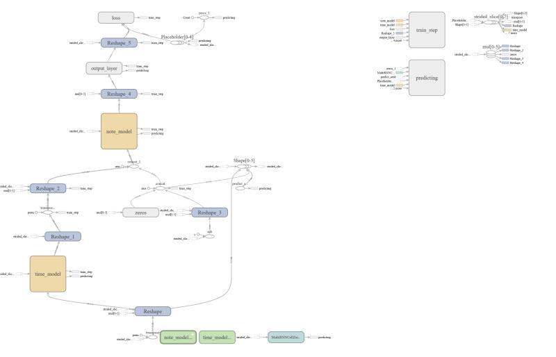

# ADS Project 5: Composing music with RNN

Term: Spring 2018

+ Team 5
+ Projec title: Compsing music with RNN
+ Team members:
	+ Yanjun Lin
	+ Yu Tong
	+ Xiuruo Yan
	+ Linna Yu
	+ Mingming Liu
	
+ Report：[ads_project5_group5.report](doc/main.pdf) 
+ Presentation Slides：[slides](doc/music.ppt)
+ Here is a tensorflow graph of our model  generated by `tensorboard`:

+ Project summary: Music is a method that we can communicate with the other people. We express our happiness, sadness and anger. However, there are mathematical relationships behind it, like the octaves, keys and scales. Because of this precise relationship, we can use computer to generate music.
    
    In this project we implemented recurrent neural network to generate classical piano sonatas and pop music. The model, which uses stack of LSTM layers and draws inspiration from convolutional neural networks, learns to predict which notes will be played at each time step of a musical piece. We built the model in TensorFlow deep learning framework and worte code in python. Here are the packages that the project depends on:
    
    **mido**, **bs4**, **lxml**, **tensorflow**, **urllib**.
    
    The main document is used to train the model. Here, you can use our pre-trained model or change arguments in the main file to train a new model. After training this model, we can use the predict part to predict new songs. 
    
    The useage of the files in `lib` folder is listed below: 
    
    * `model_tb.py` is for the biaxial model class(with tensorboard).   
    
    * `data.py` is used to clean data for the model.  
    
    * `midi_scraper.py` is for scraping midi files. 
    
    * `midi_to_statematrix.py` is to read the midi files and translate it to notestate matrix. 
    
    * `operations.py` is for truning a nupy python function to a tensorflow operation. 
    
    * `cache.py` is used to save the input format of noet state matrix, which enables us train faster whithout translating data every time.
    * `main.py` is the main python script for training, it is intergrated with data download, cache initialization and training. It has two arguments `--cache_name` and `--model_name`. Both have default value. During the training process, a new song will be generated every 100 steps.
    * `predict.py` is used to generate new music from a pre-trained model. It has two arguments `--cache_name` and `--model_name`. You need to assigne `model_name` to the script to run the script.
    
+ How to use it:
    * **For training**, move to `lib` and run `python main.py`. If you have not yet initialized the cache, there will be a popup asking you which composer you want to include, enter nothing means all composer in classical music, enter pop means train on pop music, enter any other composers' name with train on the specific composers works. (If you do not have the data from [piano-midi.de](http://www.piano-midi.de/) the script will automaticlly download for you.
    * **For generating**, new music move to `lib` and run `python predict.py --model_name ../output/model/biaxial_rnn_1524342232` this could generate the music from our pretrained model `biaxial_rnn_1524342232`. You could also replace this with the model you trained. If you do not have the cache, same thing will happen, descripted in how to use `main.py`
    * **Alternatively** you could go directly to the `doc/main.ipynb` and follow the instructions there.
	
+ **Contribution statement**: ([default](doc/a_note_on_contributions.md)) All team members contributed equally in all stages of this project. All team members approve our work presented in this GitHub repository including this contributions statement. 
    * Yanjun Lin: Implemented the bi-axis LSTM model in tensorflow, and transformation of the midi files into note-state matrixs. Trained the model using pop music and classical piano sonatas. Experimented using different optimizers (i.g. Adam, RMSProp). 
    * Yu tong: Built a midi file scraper to download midi files of classical piano sonatas.
    * Linna Yu: Found midi files of pop music from internet. Cleaned code of the project. Analysed the generated music, and chose the better ones.
    * Xiuruo Yan: Prepared the presentation. Conducted a deep research of the models that generate music.
    * Mingming Liu: Implemented the cache part to accelerate the training process. Wrote the `main.ipynb` file.

Following [suggestions](http://nicercode.github.io/blog/2013-04-05-projects/) by [RICH FITZJOHN](http://nicercode.github.io/about/#Team) (@richfitz). This folder is orgarnized as follows.

```
proj/
├── lib/
├── data/
├── doc/
├── figs/
└── output/
```

Please see each subfolder for a README file.
